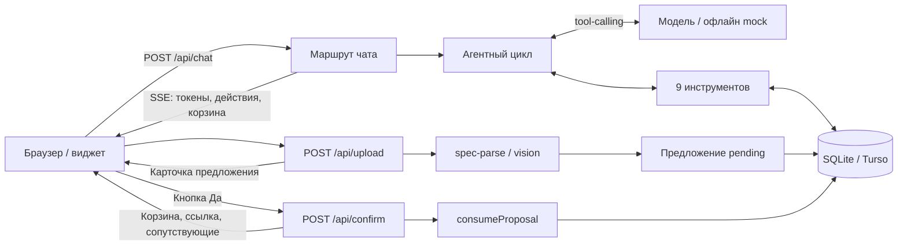
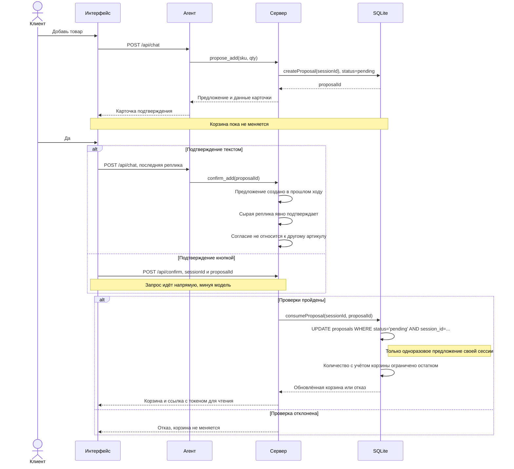

# Архитектура ассистента ekt.kz

## Поток данных

В [`loop.ts`](../src/lib/agent/loop.ts) модель выбирает инструменты,
а [`tools.ts`](../src/lib/agent/tools.ts) получает данные из БД и проверяет
действия. [`client.ts`](../src/lib/llm/client.ts) отвечает за стриминг,
таймауты, ретраи и переход к [`mock.ts`](../src/lib/llm/mock.ts).
Вложения разбираются в [`spec-parse.ts`](../src/lib/spec-parse.ts) и
[`vision.ts`](../src/lib/llm/vision.ts): таблица или накладная создаёт
предложение, фото изделия возвращает запрос для поиска. Каталог засевается
из `data/catalog.json`, запросов к API партнёра в рантайме нет. Локально
используется файловая SQLite; на Vercel нужна общая Turso для всех
маршрутов. Полностью офлайн-демо запускается локально с файловой БД
и `LLM_MODE=mock`; распознавание PDF и фотографий требует модели.

## Подтверждение добавления

Три проверки в [`runConfirm`](../src/lib/agent/tools.ts) защищают текстовый
путь. Кнопка обращается к [`/api/confirm`](../src/app/api/confirm/route.ts)
без модели. Оба пути используют только
[`consumeProposal`](../src/lib/db.ts): условный `UPDATE` одновременно
проверяет сессию и переводит предложение из `pending` в `used`; повторный
вызов не добавит товар. Остаток ограничивает итоговое количество с учётом
уже лежащего в корзине. Ссылка `/cart?c=…` открывает актуальную корзину
только для чтения. Проверки: `npm run smoke`, разделы 4 и 5;
сквозной сценарий — `npm run demo`.
